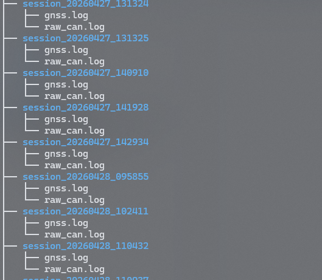
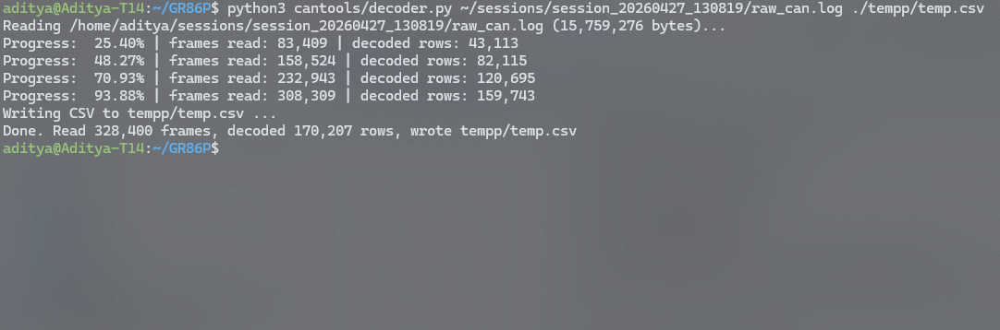
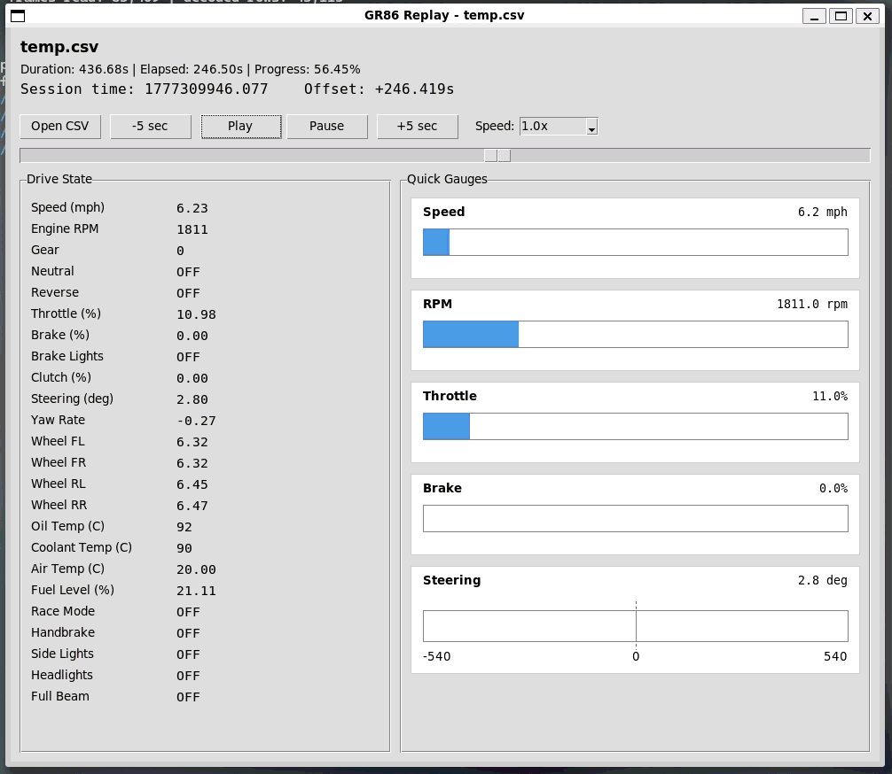
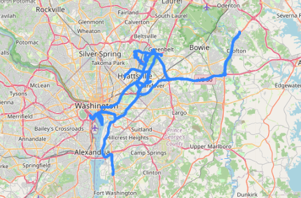

# GR86P

GR86P is my personal vehicle telemetry project built around my 2026 Toyota GR86. The goal is to turn real CAN bus and GNSS data into a system that can log, replay, summarize, analyze, and eventually gamify my drives.

This project is currently split into two major parts:

- **Part 1:** live data capture on a Raspberry Pi in the car
- **Part 2:** post-drive summarization, replay, dashboards, road discovery, scoring, and progression

---

## Project Goals

I wanted to build something that combines several things I care about:

- cars and driving
- low-level systems work
- data analysis
- UI and dashboard design
- parallel computing
- rule-based intelligence

Instead of making just a logger, the long-term goal is to build a full driving intelligence system that can:

- record CAN bus sessions
- record GNSS route data
- replay drives
- summarize each drive
- track road discovery
- score driving behavior
- track progress over time
- eventually support seasons, objectives, badges, and drive classifications

---

## Current Status

GR86P can currently:

- log raw CAN data from the car
- log GNSS data when the receiver is connected
- create one session folder per vehicle power cycle
- replay raw CAN logs
- replay drives with maps when GNSS is available
- summarize session folders using a C/OpenMP summarizer
- remove idle/useless sessions automatically
- build a local SQLite database for dashboard use
- display a simple locally hosted dashboard
- show a “roads discovered” map from all GNSS-enabled drives

The project has moved from pure data capture into the beginning of **Part 2**, where the logged data becomes useful after the drive.

---

## Part 1: Session Logger

The Raspberry Pi powers on with the car and loses power immediately when the car turns off. Because of that, GR86P is designed around **sessions** rather than clean trip shutdowns.

Each time the car powers on, the Pi creates a new session folder:

```text
sessions/
└── session_YYYYMMDD_HHMMSS/
    ├── raw_can.log
    └── gnss.log
````

The logger writes:

* `raw_can.log` — raw CAN frames in a simple text format
* `gnss.log` — GNSS records as JSON lines, when GNSS is enabled



Current Part 1 components include:

* SocketCAN-based CAN reader
* per-session folder creation
* append-only raw CAN logging
* frequent flushing/fsync for durability
* GNSS serial/NMEA reader
* GNSS JSON-line logging
* startup automation with a shell script and systemd service

This gives me durable telemetry capture even though the Pi does not shut down cleanly.

---

## Raw Log Format

The raw CAN log is intentionally simple and easy to parse.

Example `raw_can.log` line:

```text
1776194039.216195 139 8 78 55 00 E0 08 00 E5 1C
```

Format:

```text
wall_time CAN_ID DLC B0 B1 B2 B3 B4 B5 B6 B7
```

The raw log is the source of truth. Everything else is derived from it.

GNSS records are stored as JSON lines in `gnss.log`.

Example structure:

```json
{
  "wall_time": 1776194039.216195,
  "raw": "$GNRMC,...",
  "parsed": {
    "type": "RMC",
    "lat": 38.9859,
    "lon": -76.9160,
    "speed_mph": 32.4,
    "course_deg": 180.0,
    "fix_valid": true
  }
}
```

---

## Replay and Visualization Tools

I added replay tools that take logged session data and turn it into something easier to inspect.



Current replay/inspection tools include:

* raw CAN replay from `raw_can.log`
* decoded signal display
* compact Tkinter replay UI
* map-based replay when GNSS data is available
* simple playback controls such as play/pause and ±5 second seeking



This moves the project beyond raw logging and toward actual drive playback and review.

---

## Part 2: Offline Summarization

Part 2 starts with converting raw session folders into useful summaries.

The `summarize/` folder contains a C-based summarizer that parses every `session_*` folder and creates a `summary.json` file for useful drives.

The summarizer is built with OpenMP so that many session folders can be processed in parallel.

### What the summarizer does

For every session folder, it:

1. reads `raw_can.log`
2. reads `gnss.log` if available
3. decodes selected CAN signals
4. computes per-session metrics
5. creates `summary.json`
6. deletes useless/idle session folders

### Current cleanup rules

The summarizer also removes sessions that are not useful:

* If a session has valid GNSS fixes:

  * it is kept only if the car moved at least **1 mile** from the starting GNSS position
* If a session does not have valid GNSS:

  * it is kept only if CAN speed or wheel speed went over **1 mph**

This helps remove folders from short idle sessions, driveway tests, or accidental logger runs.

### Example summary metrics

The generated `summary.json` includes values such as:

* CAN frame count
* session duration
* moving time
* max RPM
* max speed
* average speed
* max wheel speed
* estimated CAN distance
* GNSS distance
* GNSS start/end position
* max GNSS distance from start
* brake light events
* accelerator stats
* steering stats
* oil and coolant temperature
* fuel level change
* gear samples
* clutch samples

---

## Dashboard Pipeline

The dashboard is built from three steps:

1. `summarize.c` creates or updates `summary.json` files
2. `roads_builder.py` builds or updates the local SQLite database
3. `dashboard.py` starts a local web dashboard

The easiest way to run the whole pipeline is:

```bash
./run_dashboard.sh
```

I am also adding a GIF showing this process:


The script runs the summarizer, updates the database, and launches the dashboard.

---

## Local Dashboard

The dashboard is a simple locally hosted HTML page served by Python.

Current dashboard features:

* Home tab with roads discovered map
* Drives tab with individual drive list
* selected-drive route map
* quick stats panel
* GNSS drive count
* total GNSS miles
* top speed
* max RPM
* discovered road cells
* placeholder pages for XP, Season, and Maintenance

The dashboard intentionally stays simple for now. The goal is to make the data easy to inspect before adding more complex scoring and visuals.

---

## Road Discovery

GNSS was added after the car already had about 10,000 miles, so the project treats the earlier data as a kind of **pre-season**.

For GNSS-enabled drives, `roads_builder.py` reads route points and stores them in SQLite.

The dashboard home page shows a combined **roads discovered** map.

Instead of redrawing every raw GNSS point forever, the road builder stores discovered road cells. This keeps the dashboard faster as the amount of logged driving data grows.

Current road discovery pipeline:

```text
gnss.log > route_points table > road_cells table > dashboard map
```
As of May 2026, this is the map of roads that I have driven. Amazing!




---

## SQLite Database

The dashboard uses a local SQLite database:

```text
gr86p_dashboard.db
```

The database stores:

* session summaries
* route points
* discovered road cells
* source file tracking metadata

`roads_builder.py` also prunes stale sessions from the database if the session folder or `summary.json` no longer exists.

This prevents deleted idle sessions from continuing to appear in the dashboard.

---

## Current Project Structure

```text
GR86P/
├── README.md
├── README_files
│   ├── CANREPLAY.gif
│   ├── DASHBOARD_RUN.gif
│   ├── DECODE.png
│   └── SESSIONS.png
├── dashboard
│   ├── dashboard.py
│   └── roads_builder.py
├── gr86-session-logger.service
├── gr86p_dashboard.db
├── logger
│   ├── can_reader.py
│   ├── config.py
│   ├── gnss_reader.py
│   ├── main.py
│   └── session_files.py
├── replaytools
│   ├── map_replay.py
│   └── simple_replay.py
├── reset_data.sh
├── run_dash.sh
├── run_logger.sh
└── summarize
    ├── Makefile
    └── summarize.c
```

---

## Main Components

### `logger/`

Runs on the Raspberry Pi in the car.

Responsible for:

* reading CAN frames from SocketCAN
* reading GNSS serial/NMEA data
* creating session folders
* writing `raw_can.log`
* writing `gnss.log`

### `summarize/`

Offline C/OpenMP analysis pipeline.

Responsible for:

* scanning all session folders
* parsing raw CAN logs
* parsing GNSS logs
* creating `summary.json`
* deleting useless idle sessions
* extracting high-level per-drive metrics

### `dashboard/`

Local post-drive dashboard.

Responsible for:

* building/updating the SQLite database
* storing route points
* storing road discovery cells
* serving the local dashboard
* showing roads discovered and individual drive maps

### `replaytools/`

Drive replay and visualization tools.

Responsible for:

* replaying logged sessions
* showing decoded CAN signals
* showing GNSS map routes when available

---

## Design Philosophy

A big part of this project has been keeping things modular and practical.

### Session-based logging

Because the Pi loses power instantly with the car, each ignition cycle is treated as a session.

### Raw data first

The raw CAN log is the source of truth. Summaries, dashboards, maps, and scores are derived from the raw data.

### Local-first

The current system runs locally. The logger writes local files, the summarizer runs locally, and the dashboard uses a local SQLite database.

### Build in layers

The project is being built in this order:

1. reliable data capture
2. replay and inspection
3. summary metrics
4. dashboard and road discovery
5. scoring and progression
6. long-term automation and cloud sync

---

## Planned Part 2 Features

Part 2 is where GR86P becomes a true post-drive intelligence system.

Planned features include:

* better session browser
* per-drive detail pages
* trend charts across many drives
* scoring and feedback
* badges and progression
* maintenance tracking
* season progress
* road discovery progression
* drive classifications
* shift quality analysis

### Example per-drive stats I want

* average speed
* max speed
* average RPM
* max RPM
* idle time
* moving time
* throttle smoothness
* brake smoothness
* steering smoothness
* shift count
* shift quality
* rev-match quality
* drive personality classification

For the manual-transmission side, I especially want to analyze:

* upshifts
* downshifts
* clutch timing
* rev-match accuracy
* rough vs smooth clutch re-engagement

That is one of the most interesting parts of the project to me.

---

## Planned Seasons / Gamification

A major long-term goal is to make the data fun, not just technical.

I want Part 2 to eventually behave like a driving progression system, with things like:

* XP per drive
* badges
* objectives
* drive classifications
* streaks
* season progress
* maintenance goals
* road discovery progression

Example ideas include:

* rewarding new roads driven
* rewarding clean or smooth drives
* tracking best rev-matched shifts
* tracking drive quality over time
* building “Season 1” starting at the GNSS era

---

## How My Classes Connect to This Project

This project also serves as a way to combine what I have learned across several computer science courses.

### CMSC416 — Parallel Computing

Used for offline session summarization and high-speed batch analysis of raw telemetry data using OpenMP.

### CMSC434 — HCI

Used for the live viewer, replay UI, and post-drive dashboard design.

### CMSC320 — Intro to Data Science

Used for per-drive metrics, trends, analysis, charts, and conclusions from vehicle data.

### CMSC335 — Web Application Development

Used for the dashboard, replay pages, session browser, and progression interface.

### CMSC414 — Computer and Network Security

Relevant for secure telemetry handling, log integrity, privacy, and eventual sync/access control.

### CMSC421 — GOFAI

Relevant for rule-based drive classification, scoring, shift analysis, badges, and objective logic.

---

## Long-Term Vision

The long-term vision for GR86P is:

* a Raspberry Pi in-car session logger
* a replayable drive archive
* an analysis engine that turns raw telemetry into useful summaries
* a local dashboard that explains each drive
* a roads-discovered map built from real GNSS data
* a progression system built around real ownership and real driving

In short, I want this project to become a personal driving intelligence system built specifically around my GR86.

---

## Current Focus

The current focus is on:

* stable session logging
* improving replay
* improving decoding coverage
* generating better summaries
* cleaning useless sessions automatically
* improving the local dashboard
* making road discovery efficient
* preparing for scoring and gamification

```
```
